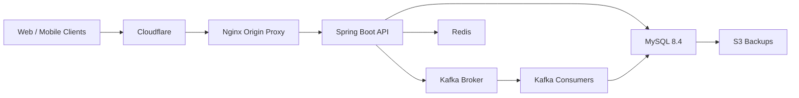
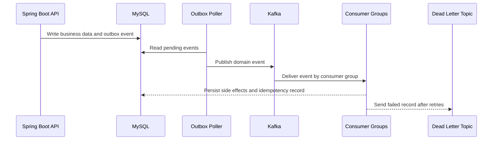

# Afrochow Backend


Afrochow Backend is the Spring Boot API behind the Afrochow marketplace. It powers authentication, customer and vendor workflows, stores, menus, orders, payments, notifications, address geocoding, file uploads, and event-driven background processing.

Production is containerized with Docker Compose and sits behind Cloudflare and Nginx, with MySQL, Kafka, Redis, and scheduled S3 database backups.

## Table Of Contents

- [Architecture](#architecture)
- [Core Services](#core-services)
- [Backend Capabilities](#backend-capabilities)
- [Event Pipeline](#event-pipeline)
- [Local Development](#local-development)
- [Production Shape](#production-shape)
- [Security Notes](#security-notes)

## Architecture



Only the HTTP(S) edge is public. Internal services such as MySQL, Kafka, Redis, backup workers, and Kafka UI are kept behind the Docker network, localhost bindings, or SSH tunnels.

## Core Services

| Service | Role |
| --- | --- |
| `app` | Spring Boot API |
| `nginx` | Public reverse proxy and TLS origin |
| `mysql` | Primary relational database |
| `kafka` | Domain event broker |
| `kafka-init` | Topic creation job |
| `redis` | Cache and geospatial store support |
| `db-backup` | Scheduled MySQL dump and S3 upload worker |
| `kafka-ui` | Private Kafka inspection UI |

## Backend Capabilities

- JWT-based authentication and account flows
- Customer, vendor, store, menu, product, and order APIs
- Stripe-backed payment workflows
- Notification creation and delivery workflows
- Address geocoding and fulfillment support
- Transactional outbox event publishing
- Kafka consumers with idempotency checks
- Redis-backed runtime support
- Dockerized production deployment
- Scheduled database backups

## Event Pipeline

Afrochow uses a transactional outbox pattern for background work. Application code writes domain events to the database, a poller publishes them to Kafka, and independent consumer groups process their own workloads.



Current event stream conventions:

```text
afrochow.domain-events
afrochow.domain-events.retry
afrochow.domain-events.dlq
```

Current consumer groups:

```text
afrochow-notification-service
afrochow-address-geocoding-service
afrochow-payment-transfer-service
```

One Kafka topic can serve multiple consumer groups safely. Each group tracks its own offsets and receives its own logical copy of each event.

## Local Development

Prerequisites:

- Java 21
- Docker Desktop
- MySQL 8 compatible database
- Maven wrapper included in the repo

Start local infrastructure:

```bash
docker compose -f docker-compose.prod.yml up -d kafka kafka-init redis
```

Compile the backend:

```bash
./mvnw -q -DskipTests compile
```

Run the app with your local Spring profile and environment values:

```bash
./mvnw spring-boot:run
```

Local `.env` and production `.env.prod` files must stay private. Use `.env.prod.example` as the shape reference for required variables.

## Production Shape

Production runs through Docker Compose with these major pieces:

- Cloudflare for public DNS, proxying, and edge TLS
- Nginx as the origin reverse proxy
- Spring Boot app container
- MySQL, Kafka, Redis, backup, and worker containers
- Private Kafka UI over SSH tunnel only
- Scheduled MySQL backups to S3

Useful production files:

| Path | Purpose |
| --- | --- |
| `docker-compose.prod.yml` | Production container topology |
| `Dockerfile` | Spring Boot app image |
| `deploy/nginx/` | Nginx origin proxy config |
| `deploy/backup/` | Database backup image and scripts |
| `.env.prod.example` | Example production environment contract |

Deployment details, credentials, certificates, server IPs, and operational runbooks are intentionally kept outside the public README.

## Security Notes

Never commit:

```text
.env
.env.prod
AWS access keys
Cloudflare origin private keys
JWT secrets
Stripe secrets
Google OAuth secrets
database dumps
uploaded user files
```

The repository keeps deployable infrastructure code, but excludes private runtime artifacts such as real environment files, cert keys, uploaded files, and backup dumps.
